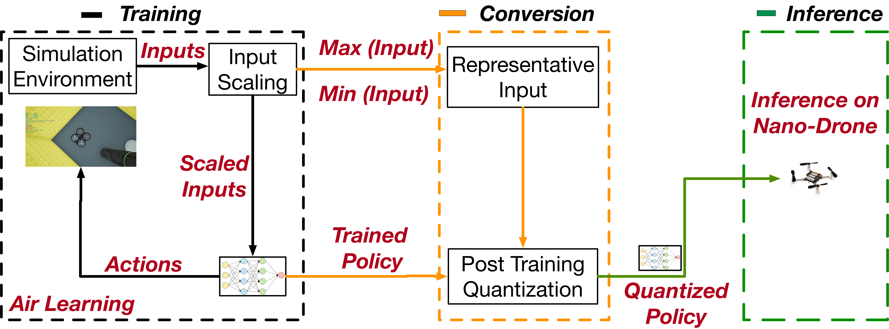

# Source Seeking on a Nano drone
In this repository, we include all code necessary for inference of a full 8-bit quantized DQN policy on a BitCraze CrazyFlie. We have used this pipeline to perform light seeking on a 31-gram nano drone (CrazyFlie).
This repository consists of the following two parts:
  - Conversion: the python code for conversion from a Tensorflow checkpoint (.cktp)
  - crazyflie-firmware: the crazyflie firmware enabling inference
  
  



# The Project

**Paper**: https://arxiv.org/abs/1909.11236
**Title**: Learning to Seek: Autonomous Source Seeking with Deep Reinforcement Learning Onboard a Nano Drone Microcontroller

**Authors**: Bardienus P. Duisterhof, Srivatsan Krishnan, Jonathan J. Cruz, Colby R. Banbury, William Fu, Aleksandra Faust, Guido C. H. E. de Croon, Vijay Janapa Reddi

**Abstract**:

Fully autonomous navigation using nano drones has numerous application in the real world, ranging from search and rescue to source seeking. Nano drones are well-suited for source seeking because of their agility, low price, and ubiquitous character. Unfortunately, their constrained form factor limits flight time, sensor payload, and compute capability. These challenges are a crucial limitation for the use of source-seeking nano drones in GPS-denied and highly cluttered environments.
Hereby, we introduce a fully autonomous deep reinforcement learning-based light-seeking nano drone. The 33-gram nano drone performs all computation on-board the ultra-low-power microcontroller (MCU). We present the method for efficiently training, converting, and utilizing deep reinforcement learning policies. Our training methodology and novel quantization scheme allow fitting the trained policy in 3 kB of memory. The quantization scheme uses representative input data and input scaling to arrive at a full 8-bit model. Finally, we evaluate the approach in simulation and flight tests using a Bitcraze CrazyFlie, achieving 80\% success rate on average in a highly cluttered and randomized test environment. Even more, the drone finds the light source in 29\% fewer steps compared to a baseline simulation (obstacle avoidance without source information). To our knowledge, this is the first deep reinforcement learning method that enables source seeking within a highly constrained nano drone demonstrating robust flight behavior. Our general methodology is suitable for any (source seeking) highly constrained platform using deep reinforcement learning.

**Video**:

[](http://www.youtube.com/watch?v=wmVKbX7MOnU "Source Seeking Video")


# Install

The following instructions are tested on Ubuntu 18.04

Conversion dependencies
```bash
pip3 install tensorflow matplotlib numpy 
```
crazyflie-firmware dependencies
```bash
sudo add-apt-repository ppa:team-gcc-arm-embedded/ppa
sudo apt-get update
sudo apt install gcc-arm-embedded
```
Clone 
```bash
git clone https://github.com/harvard-edge/source-seeking --recursive
cd crazyflie-firmware 
git submodule init
git submodule update
```
Make
```bash
make clean
make -j4
```
CrazyFlie won't fly without (custom) TSL 2591 light sensor. 
